```text
BOOTING RANJIT.DEV OS...

[✓] Identity loaded
[✓] Skills loaded
[✓] Projects loaded
[✓] GitHub activity loaded
[✓] Contribution matrix loaded
```

<div align="center">
<br>

<h3><code>RANJIT.DEV // SYSTEM ONLINE</code></h3>

<table>
  <tr>
    <td valign="top"></td>
    <td valign="top"></td>
  </tr>
</table>

<br><br>

<h3><code>$ ./contributions</code></h3>


<br>
<sub>terminal theme, zero JS, zero third-party stats services — everything above is a self-contained animated SVG, refreshed daily by a GitHub Action</sub>
</div>

---

### `$ ./projects`

> **PROJECTS / CASE FILES / BUILDS**
> *Your featured repositories and projects can go here!*

---

### `$ ./skills`

> **DEVELOPER DNA**
> *Your detailed technical skills and languages can go here!*

---

### `$ ./contact`

> **CONNECTION ESTABLISHED...**
> *Your social links, email, or LinkedIn can go here!*
